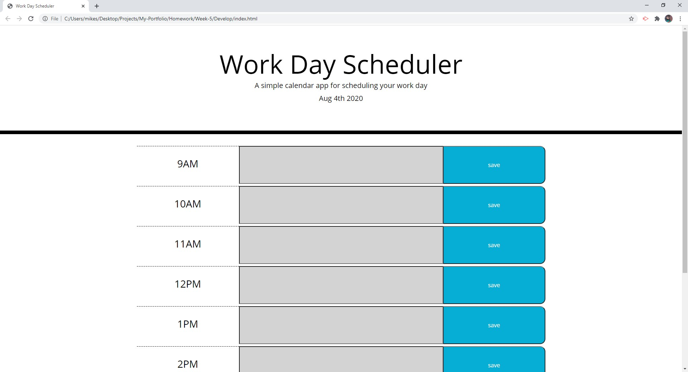

# Work Day Scheduler

This work day scheduler will be able to save different activities that a user inputs from the description box. The description box will then change colors based on what the current time is. If the current hour is in the past the box will turn grey, while if the current hour is equal to the boxes hour it will turn pink, and lastly if the boxes time is in the future of the day it will be green.

https://grantscriver.github.io/My-Portfolio/Homework/Week-5/Develop/index.html
