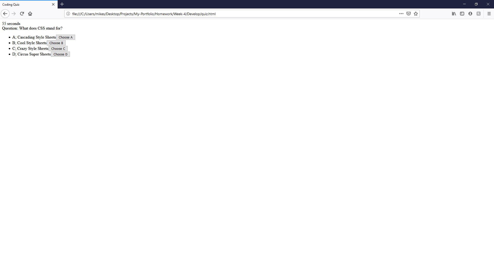

# Code Quiz

This code presents the user with a start menu. As soon as the user clicks the "Start" the quiz begins. The user will then have 60 seconds to finish the quiz, or they will receive a negative score. If the user answers incorrectly their score will also be deducted by 15 seconds. After the user has completed the quiz they are sent to a high scores page where they can input their initials and see the highest scores.

https://grantscriver.github.io/My-Portfolio/Projects/Code-Quiz/Develop/index.html
