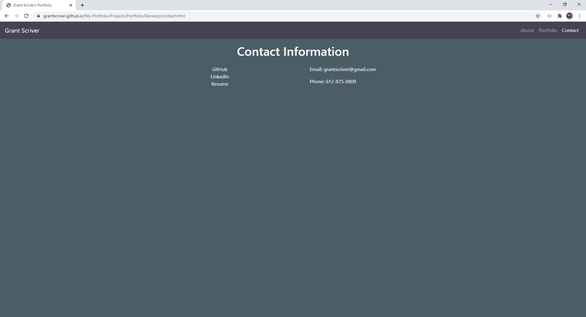

# Grant Scriver's Portfolio

## Live Site

https://grantscriver.github.io/My-Portfolio/Projects/Portfolio/Develop/index.html

## Description

This website provides an introduction to myself and what I offer in web development. Providing an interactive experience where a user can learn a lot about me from exploring the site. In the portfolio section you will see three of my applications deployed with live links. In the contact folder you can find my email, phone number, my resume, Github Profile, and LinkedIn profile.

## Demonstration of Application

## Technologies Used

HTML
Bootstrap - Framework used to structure application
CSS - Used in partnership with Bootstrap for styling purposes
Google Fonts - Used for different letter fonts

## Contributions

Application designed by Grant Scriver

## License

MIT License

Copyright (c) 2020 Grant Scriver

Permission is hereby granted, free of charge, to any person obtaining a copy  
of this software and associated documentation files (the "Software"), to deal  
in the Software without restriction, including without limitation the rights  
to use, copy, modify, merge, publish, distribute, sublicense, and/or sell  
copies of the Software, and to permit persons to whom the Software is  
furnished to do so, subject to the following conditions:

The above copyright notice and this permission notice shall be included in all  
copies or substantial portions of the Software.

THE SOFTWARE IS PROVIDED "AS IS", WITHOUT WARRANTY OF ANY KIND, EXPRESS OR  
IMPLIED, INCLUDING BUT NOT LIMITED TO THE WARRANTIES OF MERCHANTABILITY,  
FITNESS FOR A PARTICULAR PURPOSE AND NONINFRINGEMENT. IN NO EVENT SHALL THE  
AUTHORS OR COPYRIGHT HOLDERS BE LIABLE FOR ANY CLAIM, DAMAGES OR OTHER  
LIABILITY, WHETHER IN AN ACTION OF CONTRACT, TORT OR OTHERWISE, ARISING FROM,  
OUT OF OR IN CONNECTION WITH THE SOFTWARE OR THE USE OR OTHER DEALINGS IN THE  
SOFTWARE.
