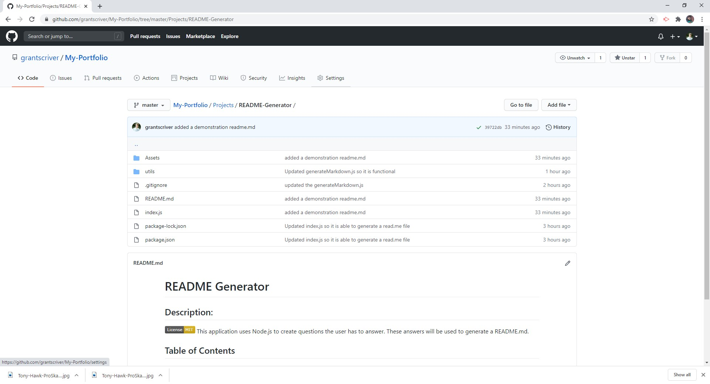
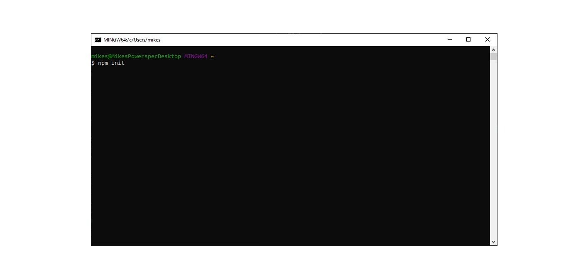
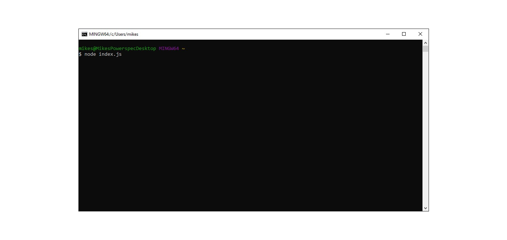

# README Generator

## Description:

This application uses Node.js to create questions the user has to answer. These answers will be used to generate a README.md.

## Table of Contents

- [Description](#description)
- [Installation](#installation)
- [Usage](#usage)
- [License](#license)
- [Contributions](#contributions)
- [Test](#test)
- [Demonstration](#demonstration)
- [Questions](#questions)

## Installation:

1. Install node.js onto your computer. The link can be be found [here](https://nodejs.org/en/)
2. Clone my repository at the link by copying this [link to github](https://github.com/grantscriver/My-Portfolio/tree/master/Projects/README-Generator) 
3. Using git bash or Terminal change directorys to where you have the rpo cloned and enter "npm init" 
4. Then enter "npm i" or "npm install" 
5. Run "node index.js" and answer the questions 

## Usage:

This application can be used to easily create README.md files.

## License:

## Contributions:

Right now I am the only one who has contributed, if you would like to then send a pull request and I will review it.

## Test:

No testing.

## Demonstration

[link to YouTube](https://youtu.be/mTt_MUZ8_Bk)

## Questions

For more information you can visit my [Github](https://github.com/grantscriver)
If you have any additional questions you can email me at: Grantscriver@gmail.com
