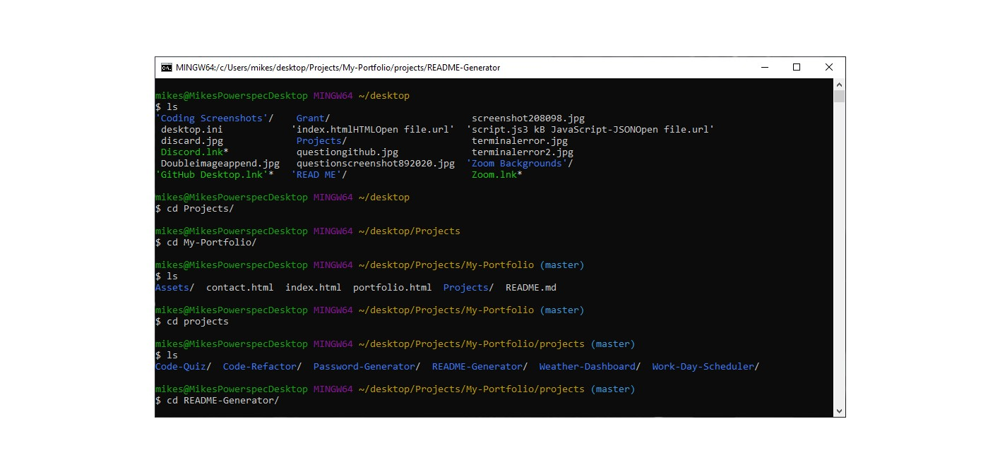

# README Generator

## Description:

This application uses Node.js to create questions the user has to answer. These answers will be used to generate a README.md.

## Table of Contents

- [Description](#description)
- [Installation](#installation)
- [Usage](#usage)
- [License](#license)
- [Contributions](#contributions)
- [Test](#test)
- [Demonstration](#demonstration)
- [Questions](#questions)

## Installation:

1. Install node.js onto your computer. The link can be be found [here](https://nodejs.org/en/)
2. Change directories to where you want it, then clone the repository at the link by copying this link in[github](https://github.com/grantscriver/My-Portfolio.git) 
3. Clone the repo using the git clone command 
4. Change directories into the "README-Generator 
5. Run "npm init" 
6. Then enter "npm i" or "npm install" 
7. Run "node index.js" and answer the questions 

## Usage:

This application can be used to easily create README.md files.

## License:

## Contributions:

Right now I am the only one who has contributed, if you would like to then send a pull request and I will review it.

## Test:

No testing.

## Demonstration

[link to YouTube](https://drive.google.com/file/d/1Kur-WbEYCbm2NhZ4mFTC7HqcKWy9ypQT/view?usp=sharing)

## Questions

For more information you can visit my [Github](https://github.com/grantscriver)
If you have any additional questions you can email me at: Grantscriver@gmail.com
