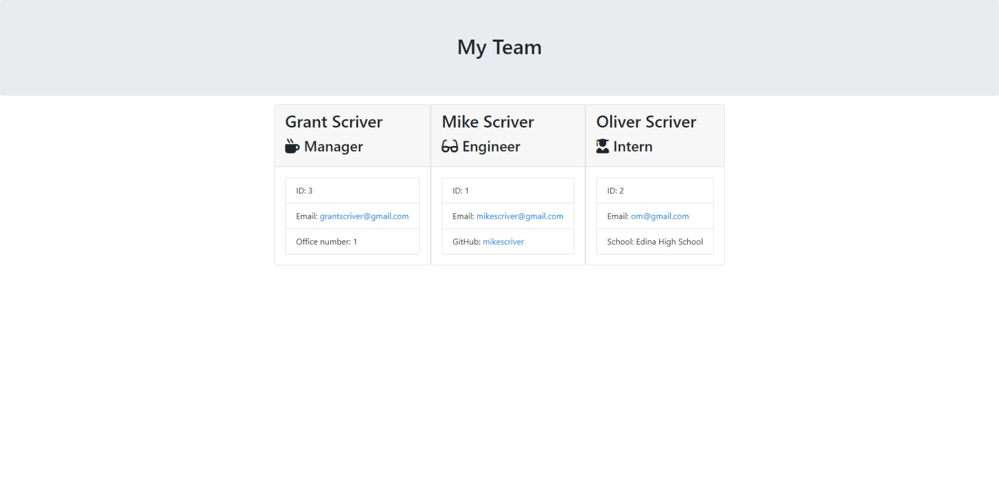
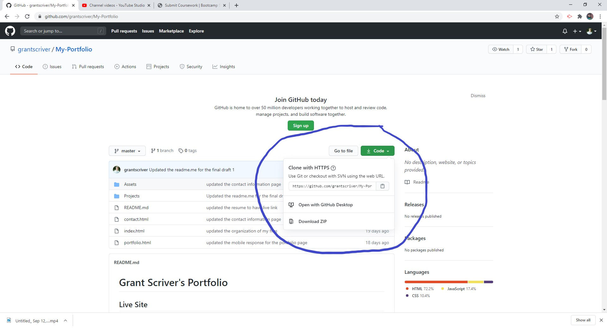
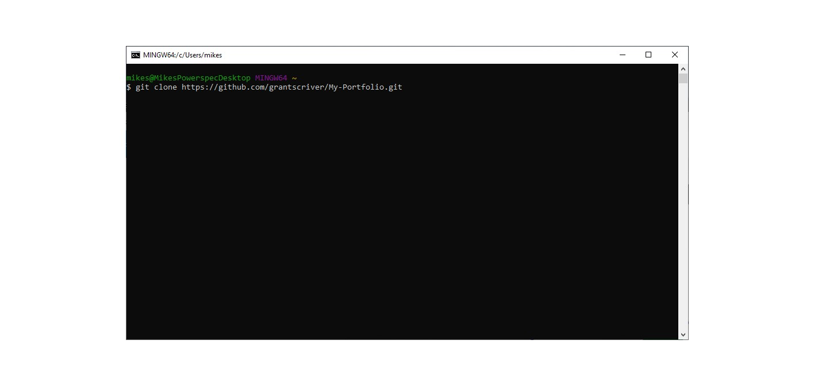
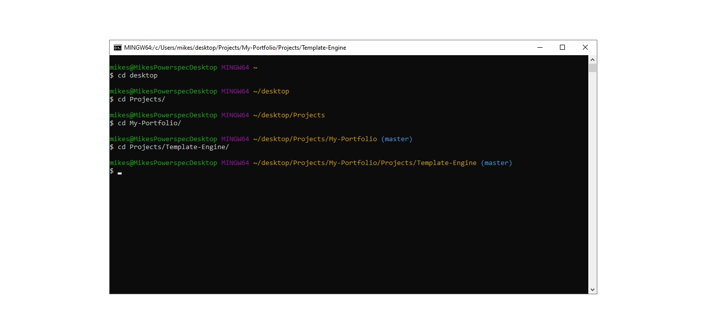
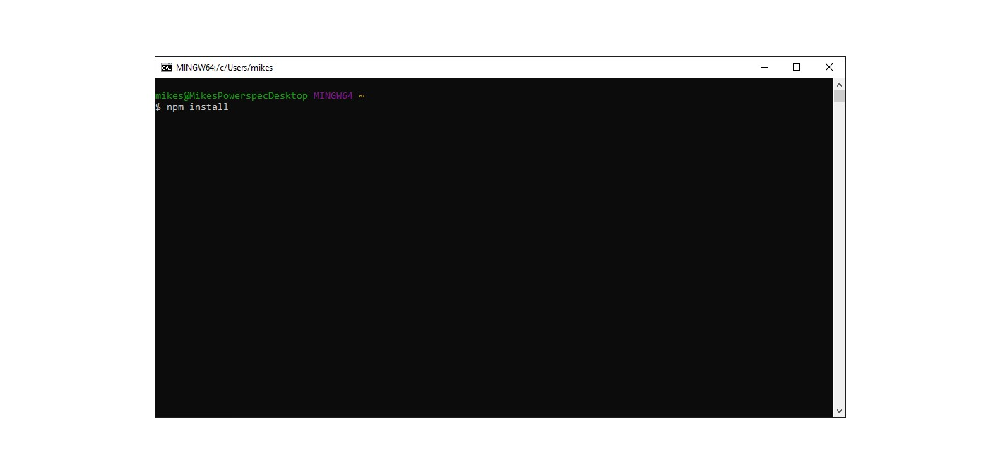
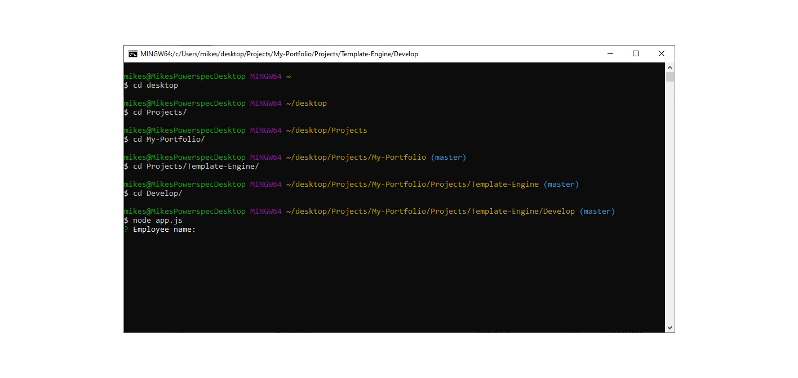
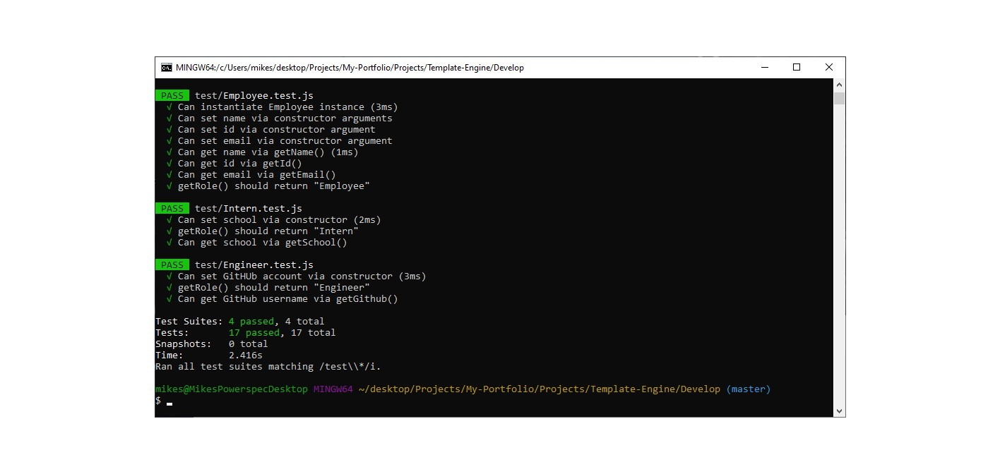

# Employee Template-Engine

## Description:

This application uses Node.js to question the user about employees with a command line. It takes the user's input and creates a an HTML page containing information about the employees.

## Table of Contents

- [Description](#description)
- [Installation](#installation)
- [Usage](#usage)
- [License](#license)
- [Contributions](#contributions)
- [Test](#test)
- [Demonstration](#demonstration)
- [Questions](#questions)

## Installation:

1. Install node.js onto your computer. The link can be be found [here](https://nodejs.org/en/)
2. Change directories to where you want it, then clone the repository by copying this link on [github](https://github.com/grantscriver/My-Portfolio.git) 
3. Clone the repo using the git clone command 
4. Change directories into the "Template-Engine/Develop" 
5. Run "npm init" 
6. Then enter "npm i" or "npm install" 
7. Run the node app.js command and then follow the prompts 

## Usage:

This application is used to generate an HTML page for anyone's employees.

## License:

## Test:

The application was test with node test and passed all the tests. 

## Demonstration

[Link to video demonstration](https://drive.google.com/file/d/1obyjZVlLBaFWYcI999cdYUNDS-ZJysEc/view)

## Questions

For more information you can visit my [Github](https://github.com/grantscriver)
If you have any additional questions you can email me at: Grantscriver@gmail.com
